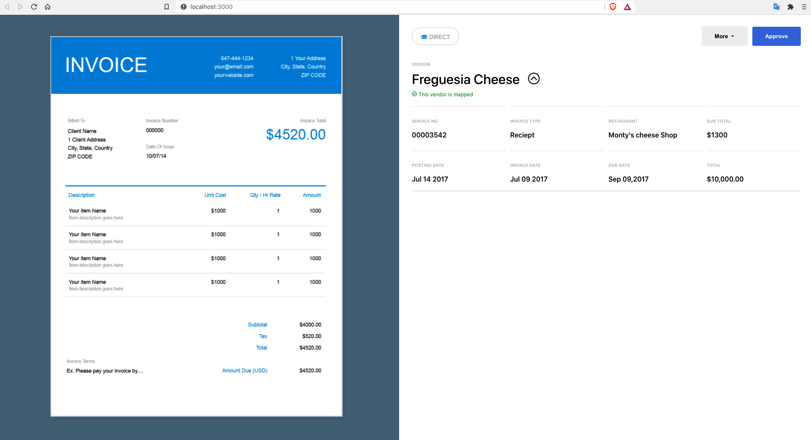

# Plate IQ Assignment

This project was bootstrapped with [Create React App](https://github.com/facebook/create-react-app).

## Overview

- This is an assignment project built using react and `react-icons`
- Mockup: [Invision App](https://subhash714461.invisionapp.com/public/share/JHX1C0XVF)
- The flow of component is coded based on `container-component` react pattern.
- Mock Data is stored in [data](src/data/index.js) as simple json
- Container makes a mock API call and gets the data. Pushes it to the components
- Components are mostly visual and hence stay logicless expect for expand and collapse functionality
- `Conditional Rendering` is used for the purpose of collapse and expand functionality

## Available Scripts

In the project directory, you can run:

### `yarn start`

Runs the app in the development mode.\
Open [http://localhost:3000](http://localhost:3000) to view it in the browser.

The page will reload if you make edits.\
You will also see any lint errors in the console.
